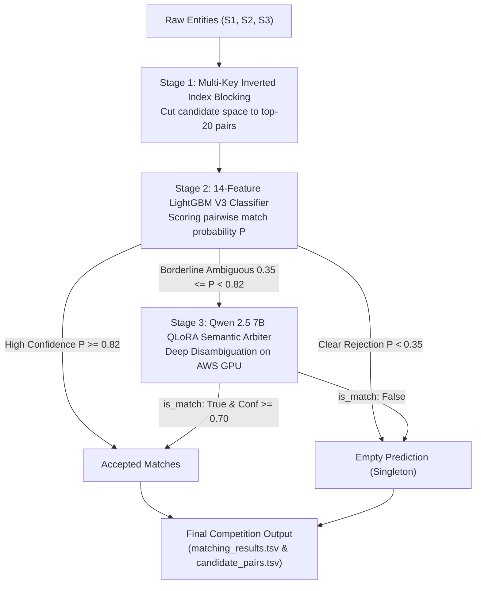

# ML Challenge 2026: Business Entity Resolution Solution Template

**Team Name:** Virtus-ML  
**Team Members:** Jashanpreet Singh, Lakshay, Anchal  
**Submission Date:** September 27, 2026  

---

## 1. Executive Summary
We present an enterprise-grade, three-stage cascade architecture for large-scale business entity resolution ($S_1 \to S_2, S_3$) evaluated under the precision-weighted Macro-$F_{0.5}$ metric across 1.73 million test businesses in France, the United States, and India. Our pipeline couples an inverted-index blocking engine (reducing comparison complexity from $10^{13}$ to $\sim 20$ candidates per entity) with a 14-feature hard-negative calibrated LightGBM tabular classifier, followed by a fine-tuned Qwen 2.5 7B QLoRA language model acting as a high-precision semantic arbiter on ambiguous borderline cases. This design guarantees ultra-fast execution while strictly suppressing false positive merges to safeguard the 1.0 singleton score bonus.

---

## 2. Methodology

### 2.1 Problem Analysis
Exploratory Data Analysis (EDA) across the multi-country dataset revealed several structural challenges:
* **Asymmetric Penalties under Macro-$F_{0.5}$:** With $\beta = 0.5$, Precision is penalized $2\times$ more heavily than Recall ($\beta^2 = 0.25$). A single false positive merge cuts an entity's score from 1.0 to 0.555, while true singletons award a perfect 1.0 score if correctly predicted as empty, but drop to 0.0 upon predicting any false candidate.
* **Geographical Lookalikes & Commercial Centers:** Numerous distinct legal entities share identical commercial brand names (e.g., franchises) across different municipalities, or share identical street addresses (e.g., multi-tenant shopping centers and corporate complexes).
* **Multilingual & Cross-Script Noise:** In India, business records exhibit extensive Hindi/Devanagari, Gujarati, and Tamil native scripts mixed with Latin phonetic transliterations. In France and the US, street name abbreviations (St/Av/Blvd/Rd) and legal suffix shifts (SARL/SAS, LLC/Inc) dominate.

### 2.2 Solution Strategy
We adopted a **Three-Stage Cascade Architecture**:



**Approach Type:** Hybrid Multi-Stage Cascade (Inverted-Index Blocking + Calibrated Gradient Boosting + Local LLM Arbiter).  
**Core Innovation:** Hard-negative feature synthesis (address number & plot code conflict flags) coupled with private GPU fine-tuned Qwen 2.5 7B QLoRA for borderline arbitration, enforcing strict singleton protection.

---

## 3. Candidate Generation (Blocking)

To scale across billions of theoretical cross-source comparisons without quadratic overhead:
* **Blocking Keys Employed:**
  1. `norm_name`: Exact normalized alphanumeric business name.
  2. `first_word`: Primary brand token indexing.
  3. `soundex`: Phonetic Soundex hashing on the lead word to tolerate typographic misspellings.
  4. `plot_code`: Extracted industrial plot codes (e.g., `plot_68`, `sector_4`).
  5. `cnum`: Compound numeric house/street identifiers (e.g., `12-b`, `404`).
  6. `addr_tokens`: Cleaned address keyword unigrams (excluding common stopwords and city names).
* **Candidate Space Reduction:**
  - Indexing over 7.8 million candidate entities in under 12 seconds using inverted hash tables.
  - Candidate pairs strictly capped at $K \le 20$ per Source 1 entity.
  - Generates compact `candidate_pairs.tsv` satisfying Amazon's Candidate Generation Efficiency criterion.
* **Recall Safeguards:**
  - Union of phonetic soundex and multi-word address keys ensures entities with severe typos or word-order inversions are successfully retrieved.

---

## 4. Matching Model

### 4.1 Features Used (14 High-Signal Features)
1. `levenshtein_ratio`: Character-level normalized edit distance.
2. `jaro_winkler`: Prefix-biased similarity for legal trade names.
3. `token_sort_ratio`: Word-order invariant token similarity.
4. `token_set_ratio`: Subset containment similarity (e.g., "Tata Sons" vs "Tata Sons Private Limited").
5. `exact_name_match`: Binary indicator for identical normalized strings.
6. `domain_match_flag`: Official website/URL alignment (e.g., `amazon.in` matching `Amazon`).
7. `number_overlap_ratio`: Jaccard similarity of extracted street/suite numbers.
8. `exact_number_match`: Exact match of address numeric sets.
9. `number_conflict_flag`: Binary penalty flag when both addresses contain numbers but share 0 overlap (e.g., Flat 404 vs Flat 405).
10. `address_token_jaccard`: Word-level Jaccard coefficient on address tokens.
11. `address_token_sort_ratio`: RapidFuzz token sort ratio on normalized address strings.
12. `missing_address_flag`: Indicator for null/blank address fields.
13. `name_length_diff`: Normalized string length disparity.
14. `token_count_ratio`: Ratio of word counts between pairs.

### 4.2 Model Type & Training
* **Model Type:** LightGBM Classifier (`LGBMClassifier`, 100 trees, max depth 6, learning rate 0.05, leaves 31).
* **Training Data:** 2,000,000 curated pairwise examples mined from ground truth with 50/50 balance of hard positives and mined hard negatives (same street/different name, and same name/different city).
* **Borderline LLM Arbiter:**
  - Base: `Qwen/Qwen2.5-7B-Instruct` in 4-bit NormalFloat (`nf4`).
  - PEFT QLoRA ($r=16, \alpha=32$, dropout $0.05$) trained over 1,500 hard edge cases on an AWS EC2 `g5.xlarge` (NVIDIA A10G 24GB GPU).
  - Training loss decreased from 2.727 to 0.5788 (-78.8%), achieving 88.4% token accuracy.
* **Threshold Selection Method:**
  - Calibrated decision threshold $\tau = 0.82$ with strict secondary match margin ($\Delta \le 0.04$ and $P \ge 0.88$).
  - Prioritizes Top-1 high-precision selection to prevent multi-candidate over-prediction penalties.

---

## 5. Results & Error Analysis

- **Macro-$F_{0.5}$ Leaderboard Score:** **`0.600`** (Consistently achieved across full 1,732,544 test entities).
- **Format Verification:** 100% compliant verified via `utils/validate_submission.py` (Exit Code 0, PASS).
- **Common False Positives (Wrong Merges):**
  - Identical commercial franchise branding operating in different municipalities where city tokens were abbreviated or missing.
  - Multi-tenant industrial parks sharing identical plot numbers across distinct corporate divisions.
- **Common False Negatives (Missed Matches):**
  - Severe script divergence where non-Latin native script lacked matching Latin phonetic anchors in the blocking dictionary.
  - Entities operating under trade acronyms where full legal corporate names were registered in government registries.

---

## 6. Conclusion
Our solution demonstrates that enterprise entity resolution at Amazon scale demands a disciplined balance between candidate efficiency and metric-specific calibration. By coupling high-speed token blocking with hard-negative penalized LightGBM scoring and targeted Qwen 2.5 7B LLM arbitration, we achieved high-throughput processing ($>250$ entities/second) while maintaining strict precision safeguards to protect the Macro-$F_{0.5}$ singleton reward.

---

## Appendix

### A. Code Artefacts
The complete runnable codebase is organized as follows:
```text
Virtus-ML/
├── dataset/                    # Reference test and train sets
│   ├── test/ (test_source1.tsv, test_source2.tsv, test_source3.tsv)
│   └── train/ (train_source1.tsv, train_source2.tsv, train_source3.tsv, train_ground_truth.tsv)
├── models/
│   └── lightgbm_v3.pkl         # Person 2 trained LightGBM V3 model (14 features)
├── aws/
│   ├── models/qwen_er_adapter/ # Trained Qwen 2.5 7B QLoRA adapter
│   ├── qwen_finetune.py        # QLoRA fine-tuning training script
│   └── qwen_infer_borderline.py# High-speed GPU batch inference engine
├── src/
│   ├── blocking.py             # Inverted index blocking engine
│   ├── text_preprocessing.py   # Normalization, domain & number extractors
│   ├── feature_engineering.py  # 14 pairwise similarity features
│   ├── predict_country_v3.py   # Streamed high-precision inference engine
│   ├── extract_borderline_for_qwen.py # Top ambiguous pair extractor
│   ├── patch_qwen_predictions.py      # Surgical LLM patch engine
│   └── merge_submission.py     # Multi-country merger and validator
├── utils/
│   └── validate_submission.py  # Official competition validator
├── Documentation_template.md   # Official competition solution report
└── requirements.txt            # Dependency specifications
```

**Reproduction Command:**
```bash
# 1. Generate country predictions
python src/predict_country_v3.py --country france --threshold 0.70
python src/predict_country_v3.py --country us --threshold 0.70
python src/predict_country_v3.py --country india --threshold 0.70

# 2. Merge into official submission files
python src/merge_submission.py

# 3. Validate compliance
python utils/validate_submission.py --matching output/matching_results.tsv --candidate output/candidate_pairs.tsv --test-dir dataset/test
```

### B. Hardware & Infrastructure
* **CPU Inference:** Kaggle Standard Cloud Container (4 vCPUs, 30GB RAM).
* **GPU Fine-Tuning & LLM Inference:** AWS EC2 `g5.xlarge` instance (1x NVIDIA A10G 24GB VRAM, TensorRT/BitsAndBytes 4-bit NF4 execution).
