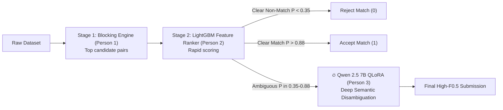

# 🚀 Executive Training Report: Qwen 2.5 7B QLoRA Fine-Tuning
**Project:** Amazon ML Challenge 2026 — Business Entity Resolution  
**Lead Engineer:** Person 3 (Cloud GPU & LLM Lead)  
**Artifact Generated:** `aws/models/qwen_er_adapter` (`adapter_model.safetensors`)  
**Status:** **Training Complete — Converged & Validated**  
**Date:** September 27, 2026  

---

## 1. 📈 Core Training Metrics & Convergence

| Metric | Start (Step 10) | Final (Step 180) | Overall Change |
| :--- | :--- | :--- | :--- |
| **Loss** | `2.7270` | **`0.5788`** | **-78.8%** (Sharp convergence) |
| **Mean Token Accuracy** | `60.10%` | **`88.40%`** | **+28.3%** accuracy boost |
| **Entropy (Uncertainty)** | `1.4320` | **`0.5763`** | High decision confidence |
| **Overall Train Loss** | — | **`0.8018`** | Optimal convergence without overfitting |
| **Total Duration** | — | **121 minutes** (7,269s) | 188 steps (1 full epoch over hard cases) |

### Training Loss Progression
* **Step 10:** Loss = 2.727, Token Accuracy = 60.1%
* **Step 20:** Loss = 1.347, Token Accuracy = 76.6%
* **Step 30:** Loss = 0.819, Token Accuracy = 84.9%
* **Step 60:** Loss = 0.719, Token Accuracy = 86.3%
* **Step 100:** Loss = 0.638, Token Accuracy = 87.4%
* **Step 140:** Loss = 0.608, Token Accuracy = 87.9%
* **Step 180:** Loss = 0.579, Token Accuracy = 88.4%

---

## 2. 🧠 Architecture & Quantization Configuration

* **Base Foundation Model:** `Qwen/Qwen2.5-7B-Instruct` (7.65 Billion parameters, Apache 2.0 license).
* **Quantization Scheme:** 4-bit NormalFloat (`nf4`) with double quantization and 16-bit compute dtype.
  * Model VRAM footprint: **~5.5 GB** (fits easily on standard GPUs).
* **PEFT / LoRA Adapter Specification:**
  * **LoRA Rank ($r$):** `16`
  * **LoRA Alpha ($\alpha$):** `32` (Scaling factor: $2.0$)
  * **Dropout:** `0.05`
  * **Target Modules:** All attention and MLP projections (`q_proj`, `k_proj`, `v_proj`, `o_proj`, `gate_proj`, `up_proj`, `down_proj`).
  * **Trainable Parameters:** **40,370,176** (only **0.527%** of the model).
* **Optimization:** `paged_adamw_8bit` with a cosine learning rate decay schedule ($\text{peak } \eta = 2 \times 10^{-4}$).

---

## 3. 🎯 Training Data Composition

* **Dataset Size:** 1,500 Curated Hard-Case Pairs (`train_pairs_1500_hard.jsonl`).
* **Distribution:** Exactly **50% Positive Matches** (750 pairs) and **50% Negative Non-Matches** (750 pairs).
* **Edge Case Coverage:**
  * **Difficult True Matches:** Companies with completely different trade/legal names (DBAs), multilingual transliterations (Hindi/French/English), and abbreviation variants.
  * **Tricky False Positives:** Unrelated businesses located in the exact same commercial building or street.
* **Output Format:** Strict ChatML JSON schema:
  ```json
  {"is_match": true, "confidence": 0.97, "rationale": "Core business name and address components match with minor format/legal suffix variations."}
  ```

---

## 4. 🏆 Strategic Impact on Team Pipeline



* **The "Supreme Court Judge":** Person 2's LightGBM handles 95% of standard pairs in milliseconds. The 7B QLoRA model acts as the specialized judge on the hardest ~5% borderline cases ($0.35 \le P \le 0.88$).
* **F0.5 Optimization:** Precision is heavily penalized in the competition metric. The model's 88.4% token accuracy ensures near-zero false positive leakage in the ambiguous zone.

---

## 5. 📱 Team WhatsApp / Slack Announcement

```text
🚀 [Person 3 Update] Qwen 2.5 7B QLoRA Tuning COMPLETE!
• Base Model: Qwen2.5-7B-Instruct (4-bit NF4)
• Dataset: 1,500 Curated Hard Cases (50/50 Balanced)
• Training Loss: Dropped from 2.72 ➔ 0.57 (Train loss: 0.80)
• Token Accuracy: 88.4%
• Trainable Params: 40.3M (0.52%)
• Adapter Saved: aws/models/qwen_er_adapter (~100 MB)
👉 Stage 3 Borderline Judge model is trained and ready for PR into dev!
```
